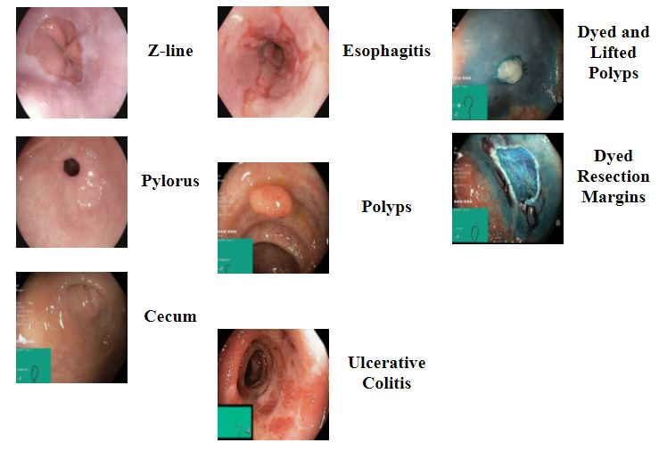
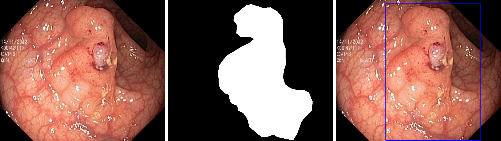
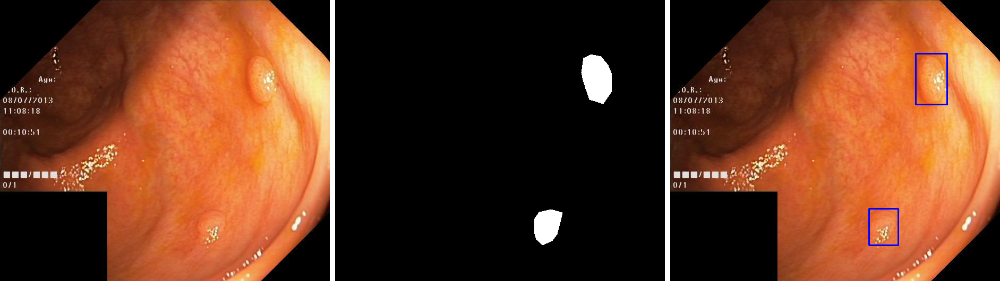
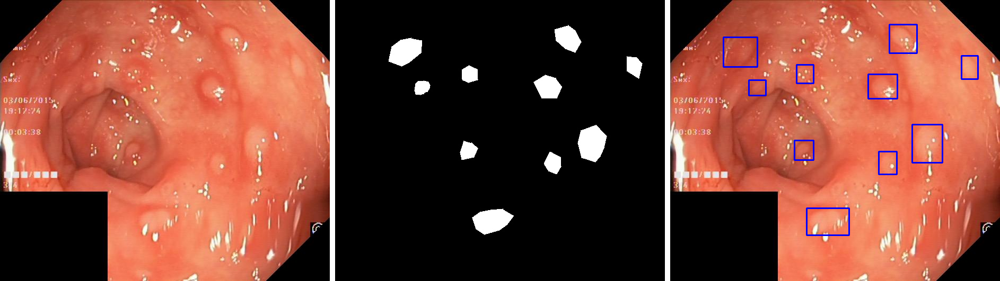
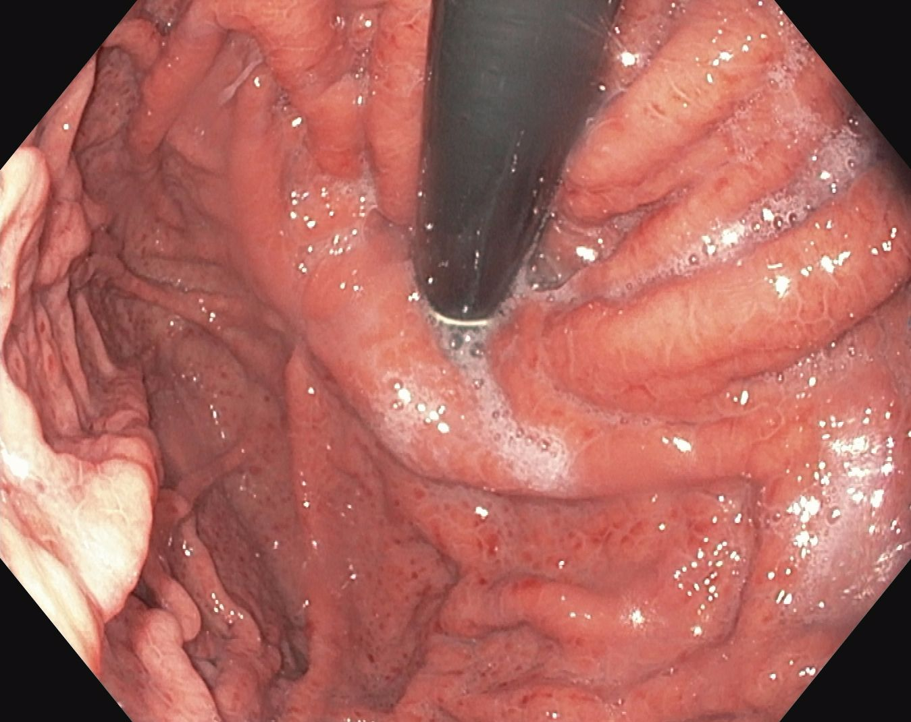
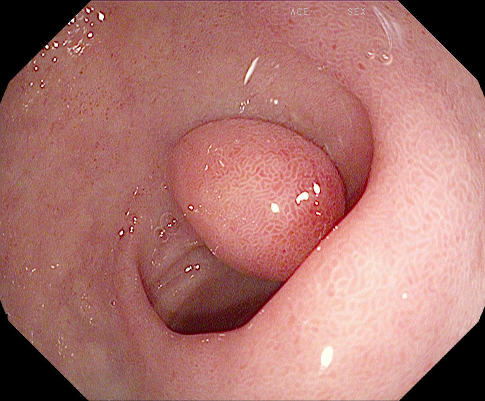
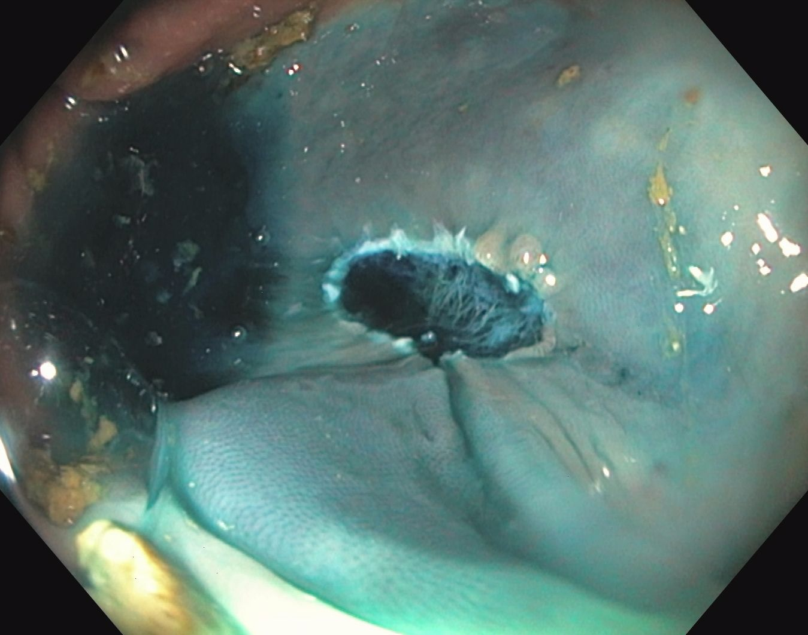

# Endoscopic-Datasets
**汇总一下网络上公开的内窥镜数据集，包括但不限于肠镜、胃镜、腹腔镜、胶囊内镜等数据集。（更新中）**
***

数据集描述格式：  
## X. 名称
* **部位：**
* **发布时间：**
* **关键词：**
* **内容：**
* **对应论文：**
* **备注：**
* **示例图像:**

## 1. [The Kvasir Dataset](https://datasets.simula.no/kvasir/)
* **部位：** 胃肠道
* **发布时间：** 2017年
* **关键词：** 解剖标志(anatomical landmarks)，病理结果(phatological findings)，内镜检查程序(endoscopic procedures)，息肉。
* **内容：** 分为Kvasir Dataset v1、Kvasir Dataset v2两个版本，两个版本均包含8个类别。其中，解剖标志三类：Z线，幽门，盲肠；病理结果三类：食管炎，息肉，溃疡性结肠炎；内镜检查程序两类："dyed and lifted polyp"，"dyed resection margins"。版本1共包含4000张图像，每类400张。版本2共包含8000张图像，每类800张。分辨率从720x576到1920x1072不等。
* **对应论文：** Pogorelov, K., et al. (2017). Kvasir: A multi-class image dataset for computer aided gastrointestinal disease detection. Proceedings of the 8th ACM on Multimedia Systems Conference.
	
* **备注：** 部分图像左下角显示奥林巴斯电磁定位系统ScopeGuide的绿色框。
* **示例图像：** 

 

## 2. [The Kvasir-SEG Dataset](https://datasets.simula.no/kvasir-seg/)
* **部位：** 胃肠道
* **发布时间：** 2019年
* **关键词：** 息肉，分割，pixel-wise mask，bounding box。
* **内容：** 在[The Kvasir Dataset](https://datasets.simula.no/kvasir/)基础上添加了segmentation masks。包含来自Kvasir Dataset v2的1000张息肉图像和对应的分割ground truth（pixel-wise mask和bounding box），分辨率从332x487到1920x1072不等。
* **对应论文：** Jha, D., et al. (2020). Kvasir-seg: A segmented polyp dataset. International Conference on Multimedia Modeling, Springer.
	

* **备注：** 数据集用黑色框代替奥林巴斯电磁定位系统ScopeGuide的绿色框，不过仍有几张图像还存在绿色框，需要预处理一下。
* **示例图像:**

 
 
 

## 3. [The Hyper-Kvasir Dataset](https://datasets.simula.no/hyper-kvasir/)
* **部位：** 胃肠道
* **发布时间：** 2019年
* **关键词：** 解剖标志(anatomical landmarks)，病理结果(phatological findings)，内镜检查程序(endoscopic procedures)，息肉，分割，标注视频。
* **内容：** 号称最大的胃肠数据集，大小有58.6G，包含110079张图像和374个视频。数据集分为四大类：
    * 第一类是标注图像，包含10662张图像，类别包含巴雷特食管，dyed-lifted-polyps，息肉，溃疡性结肠炎等，相当于[The Kvasir Dataset](https://datasets.simula.no/kvasir/)的扩充。
    * 第二类是分割图像，与[The Kvasir-SEG Dataset](https://datasets.simula.no/kvasir-seg/)相同。
    * 第三类是未标注图像，包含99417张图像。
    * 第四类是标注视频，包含374个视频，每个视频有对应的finding标签，如息肉、出血、肿瘤等。
* **对应论文：** Hyper-Kvasir: A Comprehensive Multi-Class Image and Video Dataset for Gastrointestinal Endoscopy
* **备注：** 该数据集是kvasir系列的汇总。
* **示例图像:**

 
 
 

